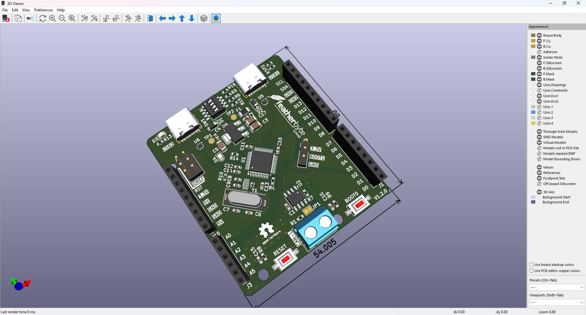
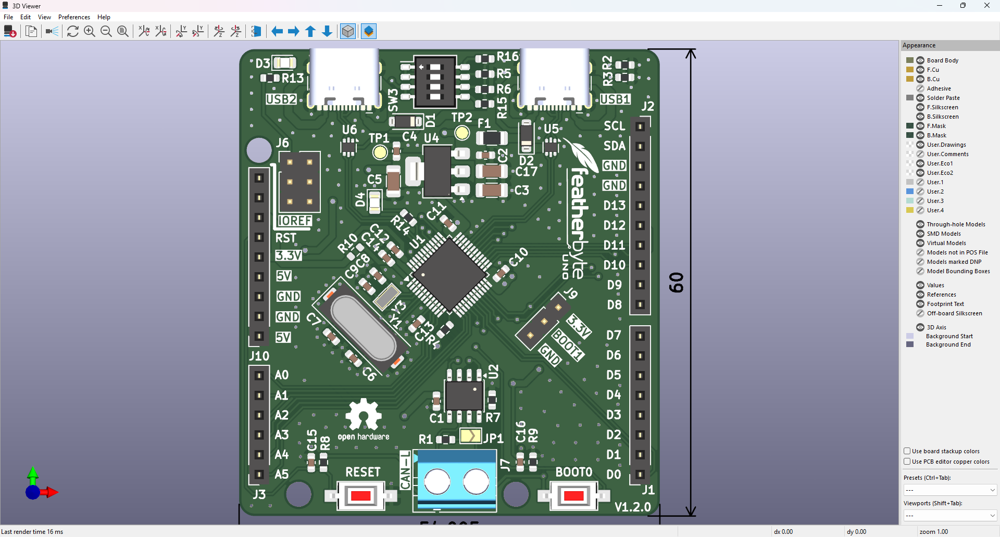
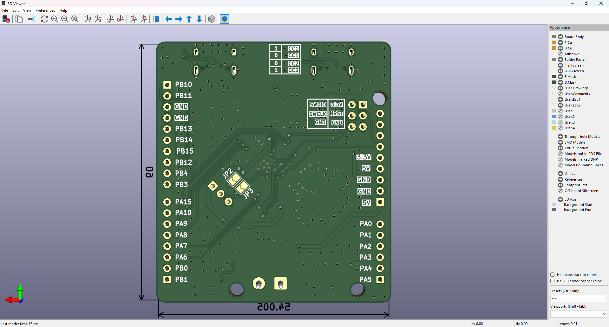
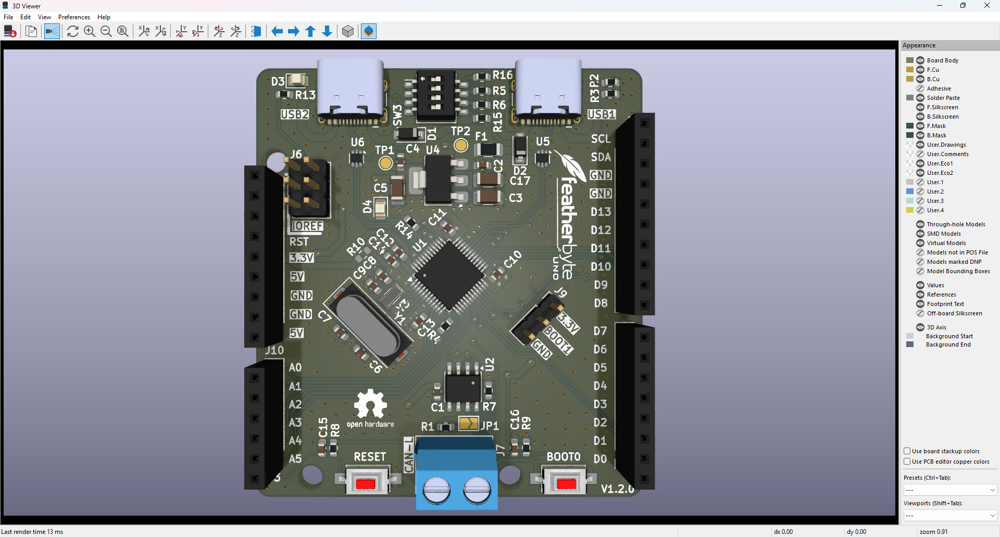
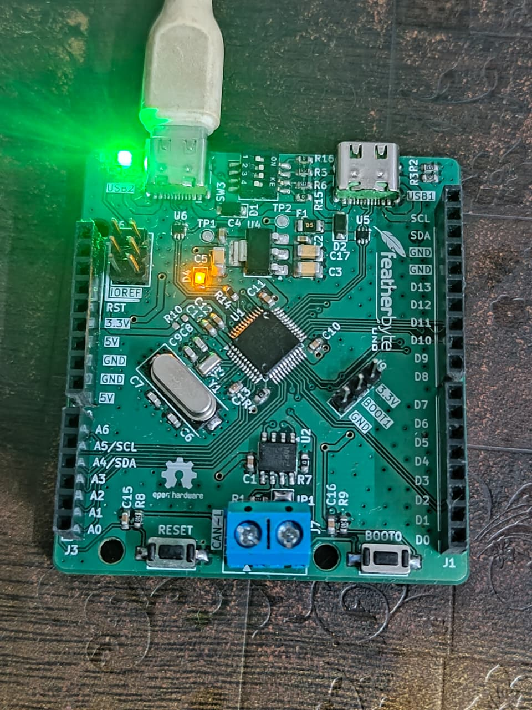
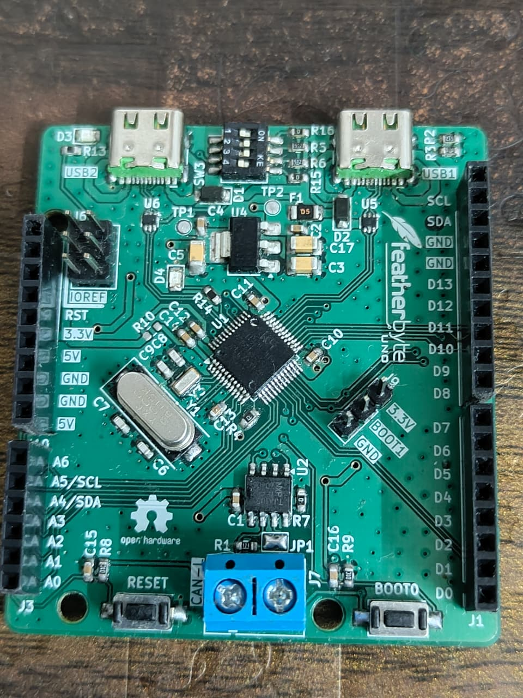
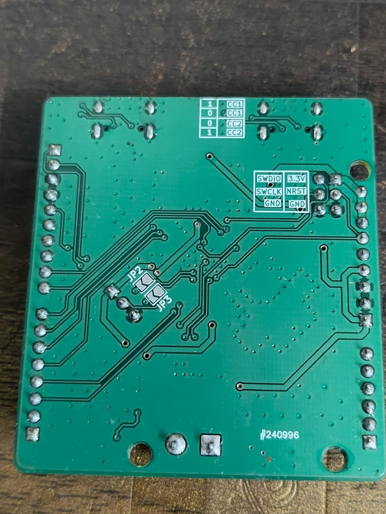

<div align="center">
  

  # Featherbyte Uno

  **A RISC-V development board in the Arduino Uno footprint.**

  USB-C • Arduino-compatible headers • CAN • Open hardware

  [Hardware](#hardware) · [Capabilities](#capabilities) · [Getting started](#getting-started) · [Manufacturing](#manufacturing) · [Project status](#project-status)
</div>

<p align="center">
  
</p>

Featherbyte Uno brings the WCH **CH32V203** RISC-V microcontroller to the familiar Arduino Uno form factor. It is designed for projects that want the practical shield ecosystem, generous headers, modern USB-C connectivity, and a hardware CAN interface in one open, inspectable board design.

> [!WARNING]
> This is an active hardware project, not yet a production-qualified board. Review the design files and validate the board for your use case before ordering or deploying hardware.

## Capabilities

| | Featherbyte Uno provides |
| --- | --- |
| **Compute** | WCH CH32V203CxT6, a 32-bit RISC-V MCU based on WCH's QingKe V4B core |
| **Form factor** | Arduino Uno–compatible header layout, board outline, and mounting pattern |
| **USB** | Two USB-C receptacles: a USB device/power-input connection and a USB host + device/power-input connection |
| **Field bus** | On-board TJA1050 high-speed CAN transceiver with a screw terminal for CANH/CANL |
| **Debug** | Dedicated SWD programming/debug header |
| **Boot control** | BOOT0 push button and BOOT1 selection jumper |
| **Power & protection** | 5 V and 3.3 V header rails, USB protection, and labelled power connections |
| **Design source** | Native KiCad schematic, PCB, symbols, footprints, 3D models, and Gerbers |

## Hardware

<p align="center">
  
  
</p>

The board preserves the recognizable Uno layout while exposing CH32V203 GPIO on the standard-style digital and analog header positions. The front side carries both USB-C connections, the MCU, boot/reset controls, CAN terminal, and the Arduino-compatible headers. The reverse side provides a clearly labelled SWD header and additional breakout access.

### Key interfaces

| Interface | What it is for |
| --- | --- |
| **USB1 / USB-C device** | Device-mode connection and power input |
| **USB2 / USB-C host + device** | USB host/device connection and power input |
| **CAN** | High-speed CAN through the TJA1050 transceiver and CANH/CANL terminal |
| **SWD** | SWDIO, SWCLK, NRST, 3.3 V, and GND for programming and debugging |
| **Arduino headers** | Digital, analog, power, I²C, and SPI-style expansion in the Uno form factor |

<p align="center">
  
</p>

## Hardware validation

<p align="center">
  
  
  
</p>

The images above show an assembled Featherbyte Uno prototype on the bench.

> [!CAUTION]
> These photographs show an **early board revision**. The current KiCad project includes silkscreen corrections and additions that are not reflected on this prototype. Treat the checked-in design files as the source of truth for the current revision.

### Blink test on real hardware

<p align="center">
  
</p>

*A blink test running on the assembled prototype. This demonstrates basic firmware execution on real hardware; it does not constitute full board validation.*

## Repository map

```text
.
├── hardware/
│   └── featherbyte-uno-v1.0.0/
│       ├── featherbyte-uno-v1.0.0.kicad_pro  # KiCad project
│       ├── featherbyte-uno-v1.0.0.kicad_sch  # schematic
│       ├── featherbyte-uno-v1.0.0.kicad_pcb  # PCB layout
│       ├── Gerber/                           # fabrication outputs
│       ├── 3d/                               # component STEP models
│       ├── footprints/                       # custom footprints
│       └── sym/                              # project symbol libraries
└── images/                                   # board renders used here
```

## Getting started

### Explore or modify the board

1. Install [KiCad](https://www.kicad.org/download/).
2. Clone this repository.
3. Open [`hardware/featherbyte-uno-v1.0.0/featherbyte-uno-v1.0.0.kicad_pro`](hardware/featherbyte-uno-v1.0.0/featherbyte-uno-v1.0.0.kicad_pro) in KiCad.
4. Use the schematic and PCB editors to inspect the design; the project-local symbol, footprint, and 3D-model assets are included.

### Program and debug

The board exposes an SWD header labelled **SWDIO**, **SWCLK**, **NRST**, **3.3V**, and **GND**. Connect a compatible 3.3 V SWD debugger to this header. Firmware, toolchain, bootloader, and flashing instructions are not yet included in this repository—please treat bring-up as development work until those are published.

## Manufacturing

Ready-to-export fabrication files are in [`hardware/featherbyte-uno-v1.0.0/Gerber`](hardware/featherbyte-uno-v1.0.0/Gerber). Before submitting an order:

1. Check the Gerbers and drill files in your fabricator’s viewer.
2. Confirm stack-up, finish, thickness, and assembly constraints against your requirements.
3. Independently verify the schematic, PCB revision, and component availability.
4. Bring up and test a small batch before any larger build.

The included hardware project identifies the current schematic revision as **v1.2.0**. The directory name is retained as `featherbyte-uno-v1.0.0` to match the checked-in project and fabrication paths.

## Project status

| Area | Status |
| --- | --- |
| KiCad source | Available |
| Gerber fabrication outputs | Available |
| PCB renders | Available |
| Firmware and examples | Not yet published here |
| BOM / assembly documentation | Not yet published here |
| License | [MIT License](LICENSE) |

## Contributing

Design review, testing notes, issues, and pull requests are welcome. For hardware changes, please include the relevant KiCad source changes and describe any electrical, mechanical, or manufacturing impact.

## License

[MIT License](LICENSE)
